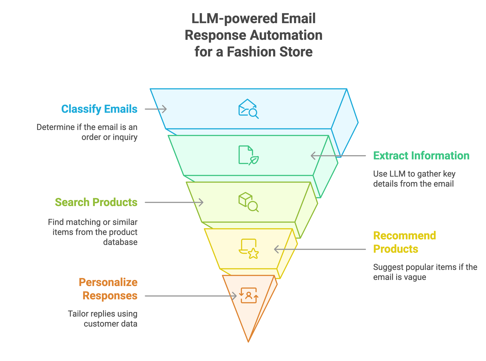

# 📬 LLM-powered Email Response Automation for a Fashion Store

## 📌 Project Overview

This project automates the classification and handling of customer emails in a fashion retail setting using Large Language Models (LLMs) and Retrieval-Augmented Generation (RAG). It intelligently distinguishes between *product inquiries* and *order requests*, responds professionally, checks stock availability, and provides recommendations using semantic search over a product catalog.

---




## 🧠 Description

The goal is to build a production-grade system that processes customer emails at scale:

### 🔍 1. Email Classification with LLMs

**Objective:** Determine whether the email is an **order request** or a **product inquiry**.

**How it's done:**
- A `ChatPromptTemplate` is passed to an LLM (e.g., GPT-4 via LangChain).
- The model is prompted with the email's subject and body.
- The model classifies the message into one of two categories:
  - `product inquiry`
  - `order request`

---

### 📦 2. Order Processing with LLMs + RAG

**Objective:** Extract product orders from emails and check availability.

#### ✅ LLM Usage:
Prompts are sent to the LLM to extract structured data such as:
- `product_id`
- `product name`
- `quantity` (including phrases like `"all remaining stock"`)

#### 🔁 RAG Usage (Fallback):
- If the product name is vague or mismatched, RAG retrieves the closest product using **FAISS**.
- Products are ranked based on **vector similarity** with `OpenAIEmbeddings`.

---

### 💬 3. Professional Response Generation

**LLM Usage:**
- The LLM generates dynamic, polite, and production-ready email responses.
- Inputs include:
  - Order status (`created`, `out of stock`)
  - Product details
  - Stock left
  - Customer name (if extracted)

✅ Ensures every customer receives a **coherent and tailored** message.

---

### 🤝 4. Handling Product Inquiries with RAG + LLM

**Objective:** Answer product-related questions (e.g., **price**, **stock**, **season** suitability).

**How it's done:**
- **RAG** retrieves the most relevant products using **FAISS vector search**.
- Retrieved metadata (name, price, stock, etc.) is compiled into structured **context**.
- The context is passed into the LLM prompt to generate **precise and helpful replies**.

---

### 🧑‍💼 5. Customer Name Extraction with LLM

- The LLM parses email text to detect names from patterns like:
  - `"Thanks, John"`
  - `"My name is Sarah"`
- Defaults to `"Customer"` if no name is found.

---

### 💡 Enhancements Over Traditional Systems

- ✅ **Semantic Search with FAISS** for fuzzy matching of vague product mentions.
- ✅ **LLM-Driven Response Generation** ensures professionalism without hardcoded templates.
- ✅ **No Regex Needed** – all logic is handled via LLM prompts.
- ✅ **Scalability** – Handles catalogs with **100,000+ products** using fast FAISS indexing.

## 🚀 Getting Started

### 📦 Dependencies

```bash
pip install langchain openai pandas faiss-cpu ipython openpyxl
```

---

### 🔽 Data

- Product and Email data are fetched from **Google Sheets** using public CSV export.
- Customize the document ID in `read_data_frame(document_id, sheet_name)`.

---

### 🏃 Executing the Program

```bash
# 1. Ensure API keys are set for OpenAI
export OPENAI_API_KEY=your_key_here

# 2. Clone the repo or open in Colab
# 3. Run the notebook cells sequentially
```

---

## 📂 Output

The results are saved to `output.xlsx` with the following sheets:

- `email-classification`
- `order-status`
- `order-response`
- `inquiry-response`

---

## 📌 Example Email

```text
Subject: I'd like to place an order

Body: Hey, can I buy 2 of the Infinity Scarves and 1 Leather Wallet? Thanks, Sarah.
```

Will result in:

✅ Email classified as "order request"  
✅ Extracted customer name: Sarah  
✅ Stock checked & order confirmed  
✅ Personalized response email generated  
✅ Result saved to spreadsheet

